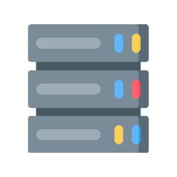
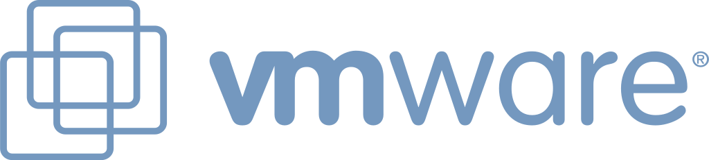
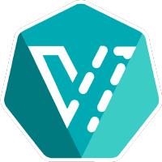
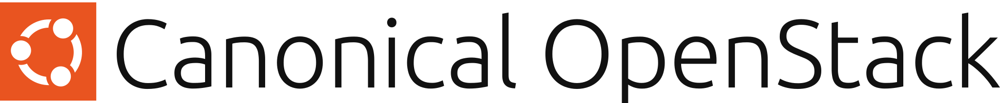
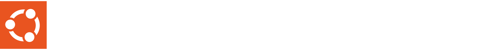

# Coriolis &#8211; Getting Started

### About Coriolis
**Coriolis®** is a fully distributed and scalable system that provides with the use of Transfers both **"lift-and-shift" migration services (CMaaS)** and cross-site **disaster recovery features (DRaaS)** between a source cloud platform and an independent destination cloud platform.

Coriolis operates without needing agents to be installed on the guest VM, relying only on the public APIs exposed by the cloud platforms to query the compute and network-related parameters of the VMs and perform data transfers. For **physical-to-virtual (p2v) migrations,** an agent must be installed on the bare-metal server in order to facilitate the ability to live-migrate it.

Coriolis has two distinct modes of operation: a one-off 'move' of an instance from one platform to another ("**migrations**"), and continuous background sync between the state of a VM on a source cloud to storage elements on the destination cloud that are ready to deploy in case of a source-side fault ("**replicas**").

Both options are available in Coriolis Dashboard under **Transfers**.


#### Replicas (DRaaS)

**Replicas** are continuous background sync of a running workload's storage from a source cloud directly to a destination cloud ("executing a replica"), and the ability to create a new VM on the destination cloud with the synced storage elements should disaster strike on the source ("deploying a replica").

#### Migrations (CMaaS)

**Migrations** represent "lift-and-shift" operations, where the goal is to copy the storage of an existing instance on the source cloud to the destination cloud and boot a new instance with identical settings.


For more information regarding Coriolis' Replica and Migration Architecture, check the [**Coriolis ' Architecture page**](../reference/coriolis-architecture.md).

### About this guide

In this guide, you will go through the initial Coriolis setup, configure the source and destination endpoints, and run a Replica Execution and Deployment as quickly as possible.

The guide details Coriolis's main features and capabilities, allowing you to evaluate all features.

## System Requirements

The **Coriolis virtual appliance** can be easily deployed as a virtual machine (VM) in any virtualization environment that meets the following minimum system requirements:

  * 40GB storage for the virtual disk of the appliance
  * 4 vCPU cores
  * 8GB RAM
  * One or more network interfaces for access to the APIs of the source and destination environments

```{note}
These requirements are suitable for a proof-of-concept or small test lab only. To ensure proper performance in a production environment, a compatibility assessment should be performed to determine the appropriate resource sizing for the Coriolis virtual appliance.
```

Coriolis is designed to meet the specific needs of each migration or disaster recovery implementation and can be easily **scaled out both horizontally and vertically** to accommodate increasing workloads. In the case of multiple parallel and simultaneous Replica or Migration jobs, additional Coriolis worker systems can be deployed for large-scale deployments.

The Coriolis virtual appliance is configured to automatically discover and perform DHCP on all network interfaces. If no DHCP server is available, a static IP configuration can be set manually through the Coriolis appliance console menu.

## Install Coriolis

Coriolis is provided as an OVA file, which can be deployed on one of the supported platforms.

For the deployment tutorial, please follow the [**Installation guide**](install-coriolis.md).

## Coriolis Console Menu

The Coriolis Console Menu is an Interactive User Console that can be accessed using the serial console of the Coriolis Appliance once the installation is complete. It will offer you options to inspect or modify the credentials, networks, and configuration files, as well as use Coriolis via CLI.

For more information, please check the **[Coriolis Console Menu](coriolis-console-menu.md)** page.

## Coriolis License

Coriolis Licenses are required to perform Replicas/Migrations. 

Replica and Migration licenses are counted separately and on a per-VM basis. In the case of a Replica, which is a continuous syncing process, a valid license is required when both creating the Replica and for the following syncs.

For further information, please check **[Coriolis Licensing](coriolis-license.md)**.

## Supported source and destination platforms

<div class="platform-row">
<div class="source-platform">
<p>Source platforms</p>
<ol>
<li class="platform"><span>Amazon Web Services (AWS)</span></li>
<li class="platform"><span>Linux servers</span></li>
<li class="platform"><span>Microsoft Azure</span></li>
<li class="platform"><span>Microsoft Hyper-V*</span></li>
<li class="platform"><span>Nutanix AHV</span></li>
<li class="platform"><span>OpenStack</span></li>
<li class="platform"><span>VMware vSphere</span></li>
<li class="platform"><span>Virtuozzo Hybrid Infrastructure (VHI)</span></li>
<li class="platform"><span>Oracle Virtualization (OLVM)</span></li>
<li class="platform"><span>Red Hat Virtualization (legacy RHV)</span></li>
</ol>
</div>
<div class="destination-platform">
<p>Target platforms</p>
<ol>
<li class="platform"><span>Amazon Web Services (AWS)</span></li>
<li class="platform"><span>KubeVirt</span></li>
<li class="platform"><span>Microsoft Azure</span></li>
<li class="platform"><span>MicroCloud (LXD)</span></li>
<li class="platform"><span>OpenStack</span></li>
<li class="platform"><span>Oracle Cloud Infrastructure (OCI)</span></li>
<li class="platform"><span>Oracle Virtualization (OLVM)</span></li>
<li class="platform"><span>Oracle Private Cloud Appliance (PCA)</span></li>
<li class="platform"><span>Proxmox VE</span></li>
<li class="platform"><span>Red Hat OpenShift Virtualization</span></li>
<li class="platform"><span>Red Hat Virtualization (legacy RHV)</span></li>
<li class="platform"><span>SUSE Virtualization</span></li>
<li class="platform"><span>SUSE Linux (KVM)</span></li>
<li class="platform"><span>VMware vSphere</span></li>
<li class="platform"><span>Virtuozzo Hybrid Infrastructure (VHI)</span></li>
</ol>
</div>
</div>

* Hyper-V support remains available, though maintenance is currently limited.

* * *

For **OpenStack**, **Coriolis** is compatible with the vanilla OpenStack project, as well as being validated with the most common OpenStack distributions from trusted vendors such as:

<div class="platform-vendors">



</div>

## Supported guest operating systems

While the Migration/Replication processes treat the VM as a black box and are agnostic as to the operating system used in the guest, the OSMorphing process is tailored to the specific guest OS release. 

Coriolis aims to support the OSMorphing process for the following guest operating system releases:

<div class="platform-row">
<div class="source-platform">
<p>Linux distributions</p>
<ol>
<li class="platform"><span>Ubuntu Server LTS 18.04+</span></li>
<li class="platform"><span>Oracle Linux 7+</span></li>
<li class="platform"><span>Red Hat Enterprise Linux 7+</span></li>
<li class="platform"><span>CentOS &amp; CentOS Stream 7+</span></li>
<li class="platform"><span>Rocky Linux 8+</span></li>
<li class="platform"><span>SUSE Linux Enterprise Server 12+</span></li>
<li class="platform"><span>openSUSE 15+</span></li>
<li class="platform"><span>Debian 9+</span></li>
<li class="platform"><span>AlmaLinux 8+</span></li>
<li class="platform"><span>Amazon Linux 2</span></li>
</ol>
</div>
<div class="destination-platform">
<p>Windows releases</p>
<ol>
<li class="platform"><span>Windows Server 2025</span></li>
<li class="platform"><span>Windows Server 2022</span></li>
<li class="platform"><span>Windows Server 2019</span></li>
<li class="platform"><span>Windows Server 2016</span></li>
<li class="platform"><span>Windows Client 11 / 10</span></li>
</ol>
</div>
</div>

* * *

Windows Server 2012 R2 has officially reached the End of Support from Microsoft. While this means that Microsoft no longer provides any maintenance for this version, **Coriolis** was still known to facilitate the migration of workloads running on Windows Server 2012 R2. This is no longer actively tested or maintained. Please refer to the Known Issues section, as the OS will also require an older virtIO set of drivers.

Older or unsupported Linux distribution releases may require custom support due to factors such as target platform compatibility, availability of guest OS package repositories, and other considerations. Please contact us for more details.

The firmware type (BIOS or UEFI) is automatically matched for the migrated VM, considering that the target platform supports the same firmware model, including features such as Secure Boot. More details can be found [here](preparing-a-vm-for-migration-replication.md#firmware-type-support).

## Coriolis Endpoints

Coriolis will save the connection details to your source and destination platforms as Cloud Endpoints. Having Cloud Endpoints will allow you to create transfer jobs to or from the platforms specified within the Cloud Endpoints.

To use the Coriolis Endpoints, please follow the **[Endpoints guide](coriolis-endpoints.md)**.

For more information regarding each supported platform, please check the corresponding page of the plugin:

<div class="platform-row">
<div class="source-platform">
<ul>
<li class="platform"><a href="../plugins/coriolis-bare-metal-hub-plugin.html" title="Bare Metal p2v">Bare Metal Migrations</a></li>
<li class="platform"><a href="../plugins/vmware-coriolis-plugin.html" title="VMWare Coriolis Plugin">VMWare vSphere</a></li>
<li class="platform"><a href="../plugins/openstack-coriolis-plugin.html" title="OpenStack Coriolis Plugin">OpenStack</a></li>
<li class="platform"><a href="../plugins/amazon-web-services-aws-coriolis-plugin.html" title="AWS Coriolis Plugin">Amazon Web Services (AWS)</a></li>
<li class="platform"><a href="../plugins/microsoft-azure-azurestack-coriolis-plugin.html" title="Microsoft Azure Coriolis Plugin">Microsoft Azure and AzureStack Hub</a></li>
<li class="platform"><a href="../plugins/hyper-v-coriolis-plugin.html" title="Microsoft Hyper-V Coriolis Plugin">Microsoft Hyper-V</a></li>
<li class="platform"><a href="../platforms/nutanix-as-a-source-cloud.html" title="Nutanix AHV Coriolis Plugin">Nutanix AHV</a></li>
<li class="platform"><a href="../plugins/kubevirt-harvester-coriolis-plugin.html" title="SUSE Virtualization">SUSE Virtualization</a></li>
<li class="platform"><a href="../platforms/suse-linux-kvm-target-platform.html" title="SUSE Linux (KVM)">SUSE Linux (KVM)</a></li>
</ul>
</div>
<div class="destination-platform">
<ul>
<li class="platform"><a href="../plugins/microcloud-lxd-coriolis-plugin.html" title="MicroCloud (LXD) Coriolis Plugin">Canonical MicroCloud (LXD)</a></li>
<li class="platform"><a href="../plugins/proxmox-coriolis-plugin.html" title="Proxmox VE Coriolis Plugin">Proxmox VE</a></li>
<li class="platform"><a href="../plugins/oracle-cloud-infrastructure-oci-coriolis-plugin.html" title="OCI Coriolis Plugin">Oracle Cloud Infrastructure (OCI)</a></li>
<li class="platform"><a href="../plugins/ovirt-coriolis-plugin.html" title="OLVM Coriolis Plugin">Oracle Linux Virtualization Manager (OLVM)</a></li>
<li class="platform"><a href="../plugins/oracle-cloud-infrastructure-oci-coriolis-plugin.html" title="Oracle PCA Coriolis Plugin">Oracle PCA solutions</a></li>
<li class="platform"><a href="../plugins/kubevirt-harvester-coriolis-plugin.html" title="Red Hat OpenShift Virtualization">Red Hat OpenShift Virtualization</a></li>
<li class="platform"><a href="../plugins/ovirt-coriolis-plugin.html" title="Red Hat Virtualization">Red Hat Virtualization (legacy RHV)</a></li>
</ul>
</div>
</div> 

For Virtuozzo's VHI platform, please refer to the OpenStack Coriolis plugin pages.

## Preparing a VM for Migration/Replication

Before starting the migration process, there is a list of recommended steps to take on a VM running on a supported source platform that is planned to be migrated/replicated with Coriolis. While these steps are not mandatory, they are recommended to ensure the smoothest migration possible.

For information regarding the steps for preparing a VM, please check the **[Preparing a VM for Replica/Migration page](preparing-a-vm-for-migration-replication.md)**.

**Note!** When preparing for a **Replica/Migration**, Coriolis will create the disks on the destination platform with an **additional 1GB** to their original size. The 1GB disk size to be added is most common for all platforms, as it is the smallest unit of measure that the clouds support.

The additional disk size on the destination platform is required to cover situations where the disk on the source may be larger only by a few bytes (than what the platform declares), and some data is written at the very end of the disk.

## Creating a Migration

**Migrations** represent "lift-and-shift" operations, where the goal is to sync a **running** workload's storage from a source cloud directly to a destination cloud and create a new instance with identical settings on the destination cloud.

The source VM continues to run throughout the data synchronization process, without downtime or service impact.

For tutorials and more information on **Migrations**, please check the [**How to create a Migration**](how-to-create-a-migration.md) page.

For **DR** information and tutorials, please check the **[How to create a Replica](how-to-create-a-replica.md)** page.

## Migrating Disk-encrypted workloads

When migrating encrypted VMs, Coriolis transfers the VM data **as-is** and does not decrypt the data during the migration process.

For the **OSMorphing** stage, a temporary migration passphrase or protector must first be configured on the encrypted partitions. This allows Coriolis to unlock the partitions during deployment and perform the required OSMorphing operations.

The migration process is as follows:

  * **Data transfer:** Coriolis transfers the encrypted VM data without decrypting it.
  * **Partition unlocking:** During deployment, Coriolis uses the provided temporary passphrase or protector to unlock the encrypted partitions.
  * **OSMorphing:** Once the partitions are unlocked, Coriolis performs the regular OSMorphing process.
  * **Cleanup:** On the first boot of the migrated VM, first-boot scripts remove the temporary passphrase or protector.
  * **Final state:** The migrated VM retains the same encryption protectors it had on the source VM.

The temporary passphrase or protector is therefore used only to facilitate OSMorphing during the migration and is not retained on the migrated VM.

Check the user guides below for more information:

[**Migrating Linux VMs encrypted with LUKS**](../features/migrating-linux-vms-encrypted-with-luks.md)

**[Migrating Windows VMs encrypted with BitLocker](../features/migrating-windows-vms-encrypted-with-bitlocker.md)**

**Note:**  Encrypted VM migrations are currently supported only when migrating to the following destination platforms:

  * SUSE KVM
  * SUSE Virtualization

Support for additional destination platforms will be added in future releases.

## Coriolis Minion Pools

Coriolis Minion Pool feature will allow the creation of **worker VMs (Minions)** on Source/Destination clouds that will act as Coriolis **temporary resources** during the **Replica/Migration** process. **Minion Pools** will improve the **time efficiency** for the Replica/Migration process, as Coriolis will no longer need to create the temporary resources and clean up when the process finishes.

For more information, please check the **[Coriolis Minion Pools Operation and Usage](../features/coriolis-minion-pools-operations-and-usage.md)** page.

The Minion Pool requires a DHCP-enabled network for the workers, so it can automatically scale up new workers and be able to connect to them. A separate and restricted network for the scope of the migration network can be created and have DHCP, which can be removed post-migration.

In case a DHCP server is not available or cannot be used, temporary Coriolis workers must be used instead. The template must have the static IP configured inside the guest OS before generalizing the VM for template creation. In such a case, only a single migration job can be executed at a time using that template, or have multiple templates with different IPs configured.

## Coriolis Projects and Users

Coriolis provides the option for multiple users to access a variety of roles to the default Project or a new one. In Coriolis, **multiple Projects can coexist** using different or the same Endpoints, but listing only the **Replica/Migration** processes performed on that Project.

For more information, please check the **[Coriolis Projects and Users documentation](coriolis-projects-and-users.md)** page.

## Coriolis CLI and API

Besides the Coriolis Dashboard, a command-line interface is available for all the Coriolis operations, as well as an API Please find more information on the **[Coriolis CLI page](../reference/coriolis-cli.md)**.

## Troubleshooting

When encountering any issue during one of the above processes, the **Coriolis Logs** option is available from both **Coriolis CLI** and**Coriolis GUI**. For more information on logs, please check the **[Coriolis Logs page](../reference/coriolis-logs.md)**. For more information regarding Coriolis Troubleshooting, check the **[Troubleshooting page](../reference/coriolis-troubleshooting.md)**.

* * *

```{note}
Before initiating any migration operation using Coriolis, you are solely responsible for creating a complete and verified backup of all data, applications, virtual machines, workloads, and configurations in the source environment. Coriolis also displays a prominent notification recommending such a backup before commencing any migration.
```

Cloudbase Solutions does not warrant against data loss resulting from the use of third-party systems or solutions, infrastructure failures, or Customer actions when used together with Coriolis.
